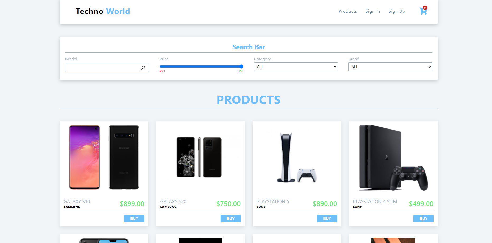
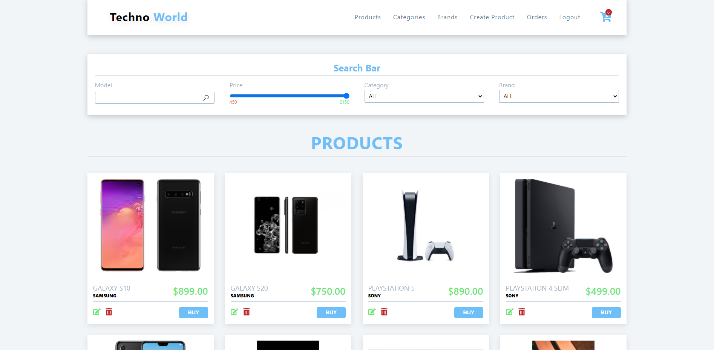

# Ecommerce

Welcome there!
This is a simple MERN Ecommerce.

You can see home page, with all available products, you can filter them by model, brand, category and price.

Also you can see single product details.

## Authenticated user

You can add products in your cart.

Also you can make order and check all your orders. 

## Admin 

If you are admin, you can create, update and delete products.

If you are admin, you can create, update and delete categories and brands.

If you are admin, you can manage all orders and you can delete already completed orders.

## If you want to check how app works. 
<a href="https://mern-stack-ecommerce.netlify.app/" target="_blank">Ecommerce</a>

## To check admin panel, please sign in with:
### Email: admin@admin.bg
### Password: admin123